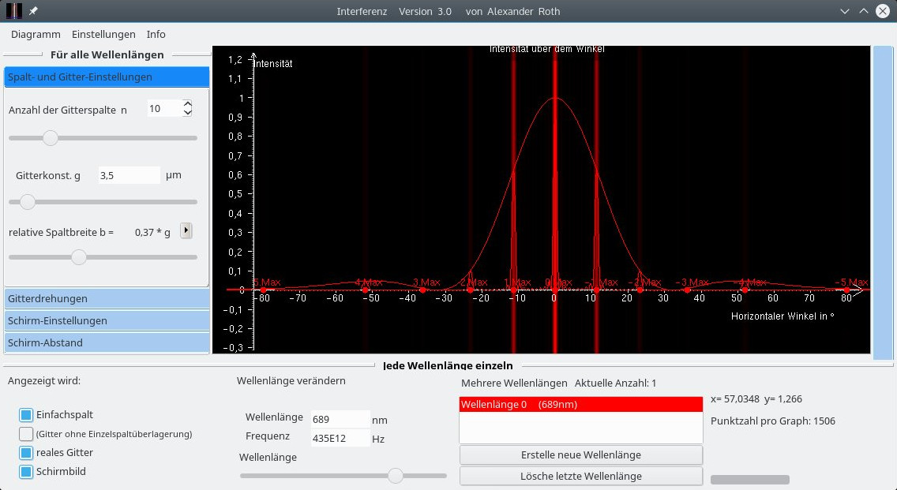
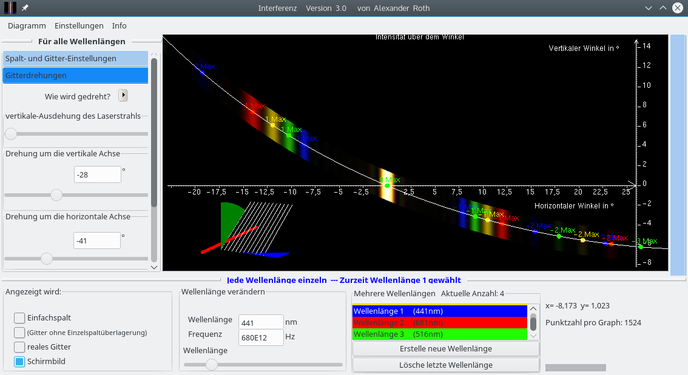

# Interferenz

I created this program to explain the diffraction pattern of an arbitrary tilted grating. With the explanation and this simulation [I was awarded first place](http://www.jugend-forscht.de/projektdatenbank/simulation-der-interferenzbilder-am-n-fach-spalt.html) in the county and state youth science competition Jugend Forscht.

## Binary

#### Linux 64 bit
Just run the binary bin/Interferenz

#### Windows 64 bit
Just run the binary bin/Interferenz.exe 


## Screenshots





# Development  Info

Synapse:  http://www.ararat.cz/synapse
  When you're in the Interferenz directory do:
  `svn checkout https://svn.code.sf.net/p/synalist/code/trunk synapse`

nxPascal:  https://github.com/Zaflis/nxpascal
  When you're in the Interferenz directory do:
  `git clone https://github.com/Zaflis/nxpascal.git`

### Components for Lazarus

Expandpanels:   http://wiki.lazarus.freepascal.org/TMyRollOut_and_ExpandPanel  
  Download and install the component into Lazarus
  `git clone https://github.com/roth-a/expandpanels.git`

ColoredBox:  https://github.com/roth-a/ColoredBox  Download and install the component into Lazarus
  `git clone https://github.com/roth-a/ColoredBox.git`

SimpleWebViewer: https://github.com/roth-a/SimpleWebViewer Download and install the component into Lazarus
  `git clone https://github.com/roth-a/SimpleWebViewer.git`
      
GroupHeader:  https://github.com/roth-a/GroupHeader    Download and install the component into Lazarus
  `git clone https://github.com/roth-a/GroupHeader.git`


### Install FPC and Lazarus 

#### Windows 
	You can download the daily snapshot from here:
		http://snapshots.lazarus.shikami.org/lazarus/
	or the older but stable version from here:
		http://sourceforge.net/project/showfiles.php?group_id=89339

#### Linux 

##### fpc

Lazarus  > 1.6

fpc

```
sudo apt-get install fp-compiler fp-units-base fp-units-fcl fp-units-gtk2 fp-units-rtl libc6 libglib2.0-dev  libx11-6 libxext6 libxi6 fp-units-db fp-units-gfx fp-units-misc fp-units-net fpc-source fp-utils libglib2.0-dev libgdk-pixbuf2.0-dev  libgtk2.0-dev 
```


##### Lazarus

install the latest Lazarus version with the following commands:

* Create the directory ~/home/Programs/Lazarus
* console command: cd ~/home/Programs/Lazarus
* console command: svn co http://svn.freepascal.org/svn/lazarus/trunk ./
* console command: make all
* Now you can start lazarus
* you have to install some of my own components (in Lazarus it is called Packages):
* go to all of this links and download the components above 
* Now go to Tools --> Build Lazarus --> Select Build IDE with Packages and select gtk2 
* When Lazarus has restart you can open my Project Interferenz and compile it by pressing F9

	
